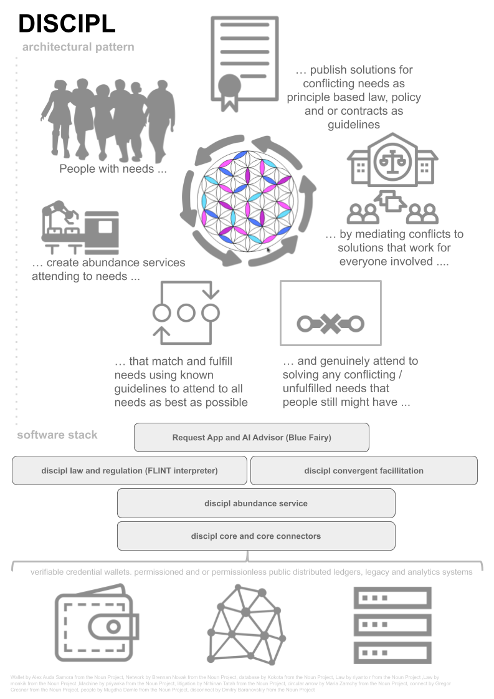

## D I S C I P L
This repository contains common resources and documentation
shared by all projects in the Discipl Software Stack.



This content has been moved to our official website:

- https://discipl.eu
- https://discipl.eu/principles/
- https://discipl.eu/technology/
- https://discipl.eu/collaboration/
- https://discipl.eu/collaboration/dms
- https://discipl.eu/roadmap/

## Discipl Projects

- **Discipl Core** 
  - [](https://travis-ci.org/discipl/core)
- **Discipl Core BaseConnector** 
  - [](https://travis-ci.org/discipl/discipl-core-baseconnector)
- **Discipl Abundance Service** 
  - [](https://travis-ci.org/discipl/discipl-abundance-service)
- **Discipl Ephemeral** 
  - [](https://travis-ci.org/discipl/discipl-core-ephemeral)
- **Discipl Waardepapieren** 
  - [](https://travis-ci.org/discipl/waardepapieren)
- **Discipl Law Reg** 
  - [](https://travis-ci.org/discipl/discipl-law-reg)

### Tools and Techniques the projects are using

- Node.js
  ```
  Node.js is used as the run-time environment to execute this program written in JavaScript. It also comes with a built-in support for package management using NPM. Discipl publishes her libraries in NPM.
  ```
- ES6 JavaScript
  ```
  ES6 stands for EcmaScript 6 and is a version of Javascript
  ```
- Travis CI
  ```
  Travis CI is a hosted continuous integration service used to build and test software projects hosted at GitHub.
  ```
- Babel
  ```
  Babel is used to transpile the ES6 to get compatible JavaScript
  ```
- Mocha - Chai - SinonJS
  ```
  Sinon allows the use of spies, stubs and mocks within the tests.
  Chai will make the coding of the test feel like writing english.
  To use Chai and Sinon, Mocha is needed as the test framework running on Node.JS
  ```
- Istanbul code coverage
  ```
  All-javascript instrumentation library that tracks statement, branch, and function coverage and reverse-engineers line coverage with 100% fidelity.
  ```
- Standard JS lint
  ```
  Automatically formats the code and catches style issues and programmer errors early.
  ```
- LogLevel
  ```
  Minimal lightweight simple logging for JavaScript. loglevel replaces console.log() and friends with level-based logging and filtering, with none of console's downsides.
  ```