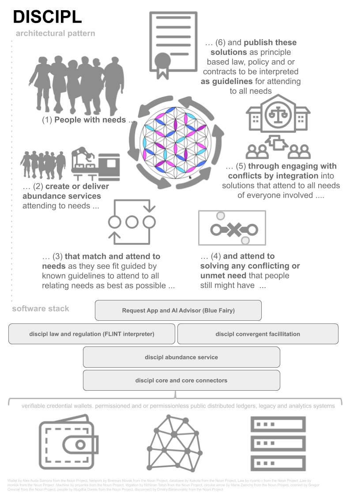

## D I S C I P L
This repository contains common resources and documentation
shared by all projects in the Discipl Software Stack.

 
Discipl focuses on an evolved society in a needs based economy (a network economy of abundance / resource based economy) and tries to progress society to this by underpinning
society with a DIstributed Collaborative Information PLatform. Needs (both demand and supply) are expressed anonymously by entities (people and things) and taken
care of automatically and for free as much as possible following law, regulations and policies, which contain the previously established solutions for conflicting needs. Conflicts are taken
care of through timely and efficient convergent facilitation processes, possible at multiple levels and which is mostly a human-guided dialogue between stakeholders.
As a last resort conflicts can put to an end at the level of judicature. These processes can lead to alteration in policies and even law and regulations and therefore the automated servicing of needs. This is what we call the Discipl Pattern. An embedded agile "polder-model" 3.0, based upon a better consensus model that takes everyone seriously.

We care about all beings deeply no matter their peculiarities, capabilities or beliefs and so on. We attend to the non controversial essence of the needs of all where possible but are always confident we can find solutions that work for all. We think organizations (both non-profit as for-profit sector) can progress to this future by embracing the Discipl Manifesto:

1 We create sustainable, highly automated solutions that fulfill people’s needs;  
2 Solutions can be produced and installed relatively simply for (free of charge) use;  
3 Solutions are open source, having a Creative Commons license or a GPL version 3.01;  
4 Solutions apply the Discipl Pattern;  
5 We respect the current legal frameworks  

There's a lot to do to make this work, even as proof of concept. The current world is not really incentivised to make this happen, though the transition harbors great opportunities for conservative entities finding security in holding on to this "old" world too. To experiment with the required technology we are creating a reference implementation of a software stack that could bootstrap this new world.

Discipl Core is the most bottom layer of this stack, implementing vendor independent (both personal as distributed) storage, self sovereign identification and authentication functionalities. It provides a single context dependent source of verifiable linked data channels kept in any platform that can hold such data (every platform with it's own specific characteristics), and
use those platforms in a hybrid way.

On itself, Discipl Core is an innovative project that focuses on communication through personal claims of self sovereign entities as a lean and simple to use technology that is the result of combining Linked Data, Open Data, Open Government, Verifiable Credentials and Distributed Ledger concepts and trends without trying to reinvent wheels. Discipl Core is not a platform intended to rule them all, but it can be really handy when you need to support multiple platforms, and make your users able to choose their own type of platform or wallet (if there are multiple to choose from that provide sufficient functionality: you decide). It can make your solution platform and vendor independent, make data portable (migrate from one to the other) and so on. You could even connect with legacy systems in the same way.

Note the absence of smart contracts. Smart contracts are just automated responses for actors on the platforms that support smart contracts; where a platform supports maintaining a single truth, you can make all logic executed at client devices instead of executing this redundantly on all nodes that form the platform's infrastructure. It is analog to database programming: you don't need it, though of course you could use it, using the platform as a cloud. With the Discipl Pattern, we envision laws expressed in natural language sufficiently labeled to be interpreted as code (Law as code instead of Code as law). Decisions are never done by computers or AI. We hold on to an open world assumption and this means holding on to the assumption that reality is more complex than you can describe in laws or code. Judicature already knows this (or it should). Big Data is almost always biased too. We hold on to the established concept in that we resolve conflicts with mutual agreements which all stakeholders genuinely accept, via real dialogue about the non controversial essence of what drives us in our opinions and beliefs. When there's no conflict in needs, then there's nothing to resolve or to do for humans other than automate their fulfillment.

Why you would use Discipl now?

For instance: you can maintain, retrieve information on all supported (and suitable) platforms and have people use their verifiable credentials solution of their own choice within a single implementation. This is handy for instance when giving tourists reduction or vote rights in return of attesting their stay at hoteliers that also can choose their own platform and method of identifying for enrolling in such service as it would allow them to pay their taxes (we all should have agreed with as being part of the community of this country) in a more convenient automated way. One of these tourists could be a teacher from Amsterdam who after expressing his need for self actualization would have automatically found and enrolled in getting a benefit specifically applicable for his situation. He would be able to easily exchange it's old Diesel car for an e-bike using a special one time grant after his drivers license was revoked due to having problems with his sight, a decision he does not accept however so a process could be started to handle this conflict automatically. It would also enable free open anonymous statistics with which more can be done in other use cases. It would probably give rise to open decentralized free marketplaces and social media. All this using Discipl (or compatible apps; everyone can build upon it for free).

But this is peanuts compared to what we're aiming at. Taxes, benefits, grants, all things money; in the end all this will not be necessary in the society we envision. It is experimental too though and is AS IS. Use it as you like. We never promised you a rose garden.
